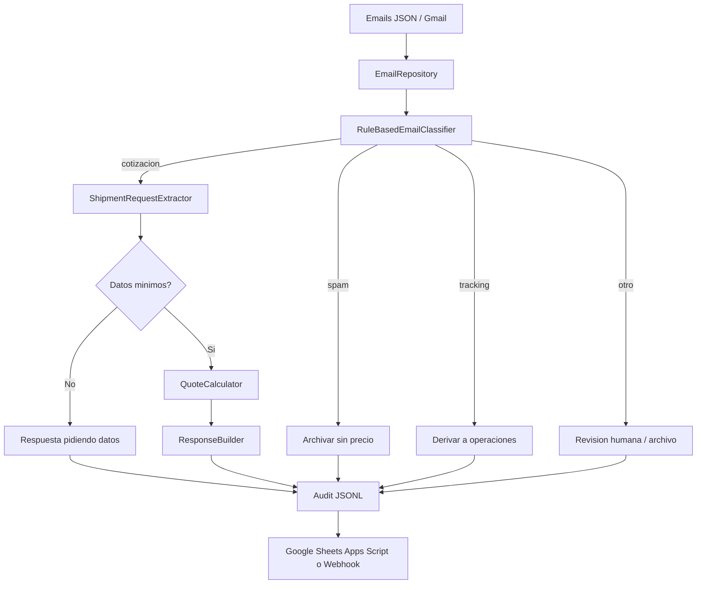

# Mini-cotizador Transportes La Serena


Mini-cotizador automatizado para clasificar emails, cotizar fletes y registrar auditoria externa para Transportes La Serena Ltda.

**Autor:** Bruno San Martin Navarro  
**LinkedIn:** [linkedin.com/in/sanmabruno](https://www.linkedin.com/in/sanmabruno/)

## El Problema

Transportes La Serena recibe correos mezclados: solicitudes de flete, preguntas incompletas, ofertas comerciales y consultas de tracking. El desafio exige responder cotizaciones validas en menos de 5 minutos, no inventar precios cuando faltan datos y filtrar correos que no correspondan. La solucion deja los calculos fuera del LLM para reducir alucinaciones y mantener auditoria.

## Arquitectura



Estructura principal:

```text
src/cotizador/
  classifier/      Clasificacion de emails
  quotation/       Extraccion y motor de tarifas
  responder/       Plantillas de respuesta
  integrations/    Webhook / Google Sheets
  config/          Constantes de negocio
  application/     Caso de uso end-to-end
  presentation/    CLI y FastAPI
tests/             Tests backend
frontend/          Dashboard React/Vite
prompts/           Prompt final versionado
flows/             Diagrama del flujo
docs/              Auditoria, demo e integracion Sheets
```

## Clasificacion de Emails

| Email | Remitente | Resultado | Accion |
|---|---|---|---|
| 1 | `psepulveda@ferreteriaeltornillo.cl` | Cotizacion | Responde con precio: `$82.800 CLP` |
| 2 | `rdiaz@distvinossur.cl` | Cotizacion ambigua | Pide origen, destino, pallets/equivalencia y tipo de carga. No inventa precio. |
| 3 | `mgonzalez@supermercaderiascentral.cl` | Cotizacion compleja | Responde precio mensual y total 6 meses. |
| 4 | `ventas@gpsrastreocl.com` | Spam comercial | Archiva/notifica admin. No envia precio. |
| 5 | `bodega@ferreteriaeltornillo.cl` | Tracking | Deriva a operaciones. No envia precio. |

Si llega un email ambiguo que no entra en ninguna categoria, queda como `other`: no se cotiza, se archiva o deriva a revision humana segun configuracion operativa.

## Logica de Tarifas

| Tramo | Estandar | Refrigerado |
|---|---:|---:|
| Santiago <-> La Serena (~470 km) | $18.000 CLP | $28.000 CLP |
| Valparaiso <-> La Serena (~500 km) | $19.500 CLP | $29.500 CLP |
| Valparaiso <-> Santiago (~120 km) | $8.000 CLP | $12.000 CLP |
| La Serena <-> Antofagasta (~880 km) | $32.000 CLP | $48.000 CLP |
| Santiago <-> Puerto Montt (~1.030 km) | $38.000 CLP | $55.000 CLP |

Reglas:

- Urgencia `<48h`: `+15%`.
- Seguro de carga: `2%` del valor declarado, minimo `$15.000 CLP` por viaje.
- Contrato mensual fijo, `>=4` viajes/mes: `-10%`.
- Contrato semestral: `-5%` adicional despues del descuento mensual.

Ejemplos validados:

- Email 1: `4 pallets * $18.000 = $72.000`; urgencia `15% = $10.800`; total `$82.800 CLP`.
- Email 3: `8 pallets * $29.500 * 8 viajes = $1.888.000`; mensual `-10% = $1.699.200`; semestral `*0,95 = $1.614.240`; seguro minimo `8 * $15.000 = $120.000`; total mensual `$1.734.240 CLP`; total 6 meses `$10.405.440 CLP`.

## Stack Elegido y Justificacion

Elegido:

- Python + FastAPI: reglas testeables, facil de auditar, sin depender de un SaaS de automatizacion para el nucleo.
- Google Sheets Apps Script: integracion externa real, gratuita para una demo y facil de revisar por negocio.
- Webhook generico: permite conectar Make, Zapier, n8n, Slack o Airtable sin cambiar el motor.
- React/Vite: dashboard demostrable para ver clasificacion, acciones y respuestas.

Descartados como motor principal:

- Make/Zapier: rapidos, pero dependen de cuenta, limites por tarea y costo si escala.
- n8n: buena opcion self-hosted, pero agrega mantencion y despliegue.
- Google Apps Script puro: integra bien con Gmail/Sheets, pero es mas debil para tests, Clean Architecture y calculos auditables.
- Airtable como nucleo: buena UI operativa, pero agrega costo/dependencia y no mejora el motor de reglas.

## El Prompt

El runtime actual no usa LLM para calcular ni clasificar; las respuestas salen de plantillas deterministicas. Este es el prompt final literal propuesto para un paso opcional de redaccion con modelo, manteniendo los montos calculados por codigo:

```text
Actua como asistente de ventas de Transportes La Serena Ltda., empresa chilena de logistica.

Contexto operativo:
- Solo debes redactar respuestas para emails clasificados por el sistema como cotizacion o cotizacion_ambigua.
- Las tarifas y calculos ya fueron resueltos por el motor deterministico del sistema.
- No inventes rutas, origen, destino, cantidades, dimensiones, tipo de carga, valor declarado, seguro ni precios.
- Si el payload trae quote_total_clp, usa exactamente ese monto y no recalcules.
- Si faltan datos obligatorios, pide solo esos datos faltantes y no entregues precio.
- Si el email fue clasificado como spam_comercial, tracking_request u otro, no redactes cotizacion.

Tono:
- Profesional, claro y breve.
- Espanol de Chile, sin exceso de formalidad.
- Firma como "Equipo Transportes La Serena".

Entrada esperada:
- sender
- classification
- missing_fields
- route
- pallet_count
- cargo_type
- monthly_trips
- quote_total_clp
- contract_total_clp
- applied_surcharges
- applied_discounts
- assumptions

Salida:
- Un cuerpo de email listo para enviar.
- Explica recargos/descuentos solo si vienen en applied_surcharges o applied_discounts.
- Incluye consideraciones solo si vienen en assumptions.
```

Modelo de IA usado para disenar y validar el paso de redaccion: ChatGPT con criterio de prompt cerrado; para una integracion productiva usaria GPT-4.1 mini o equivalente liviano. La razon es costo bajo, buena calidad en espanol y latencia suficiente para el SLA de 5 minutos. La IA se aplica a criterio, clasificacion asistida y redaccion sobre datos ya estructurados; las tarifas quedan en reglas auditables para evitar montos inventados.

La comparacion Claude vs GPT-4o esta preparada en [`docs/model-comparison.md`](docs/model-comparison.md) y se ejecuta con:

```bash
export OPENAI_API_KEY="..."
export ANTHROPIC_API_KEY="..."
python3 scripts/run_model_comparison.py
```

En esta revision no se incluyeron respuestas de modelos porque no habia credenciales `OPENAI_API_KEY` ni `ANTHROPIC_API_KEY` disponibles en el entorno. Incluir un diff inventado seria enganoso; el script genera `docs/model-comparison-results.md` con salidas reales cuando existan credenciales.

## Decisiones de Diseno y Trade-offs

- El clasificador es heuristico y deterministico. Para 5 casos controlados es mas auditable que un LLM y evita clasificaciones no reproducibles.
- Las rutas solo se cotizan si estan en la tabla oficial. Esto limita cobertura, pero evita inventar tarifas.
- "2 viajes semanales" se transforma en 8 viajes/mes para seguir el criterio esperado del desafio, aunque una conversion comercial promedio seria 8,67.
- Si se pide seguro sin valor declarado, el sistema aplica el minimo de $15.000 CLP por viaje indicado en las reglas de negocio.
- `setup.py` y `pyproject.toml` coexisten por compatibilidad con instalacion editable y herramientas modernas.
- La URL real de Google Sheets no se versiona. TODO operativo: crear deployment Apps Script y configurar `COTIZADOR_GOOGLE_SHEETS_WEBHOOK_URL`.

## Como Ejecutar

Backend y tests:

```bash
python3 -m pip install -e .
PYTHONPATH=src python3 -m unittest discover -s tests -v
```

Configuracion local real:

```bash
cp .env.example .env
```

Edita `.env` y reemplaza:

- `COTIZADOR_GOOGLE_SHEETS_WEBHOOK_URL` por la URL `/exec` del deployment de Apps Script.
- `SMTP_USERNAME` por tu Gmail.
- `SMTP_PASSWORD` por una App Password de Gmail, no la contrasena normal.
- `SMTP_FROM` usando el mismo Gmail.
- `COTIZADOR_EMAIL_OVERRIDE_TO=brunorodolfosanmartinnavarro@gmail.com`.
- `COTIZADOR_EMAIL_DRY_RUN=false` para enviar correos reales.

El backend carga `.env` automaticamente al iniciar. Antes de la demo, verifica integraciones con:

```bash
curl http://127.0.0.1:8000/integrations/status
```

Para que la demo real este lista, debe responder `google_sheets.configured: true`, `email.enabled: true` y sin warnings criticos.

CLI end-to-end:

```bash
PYTHONPATH=src python3 -m cotizador.presentation.cli \
  --input data/emails.json \
  --audit-log out/final_validation.jsonl
```

FastAPI:

```bash
PYTHONPATH=src python3 -m uvicorn cotizador.presentation.api:app \
  --host 127.0.0.1 \
  --port 8000
```

FastAPI con Google Sheets:

```bash
COTIZADOR_GOOGLE_SHEETS_WEBHOOK_URL="https://script.google.com/macros/s/..." \
PYTHONPATH=src python3 -m uvicorn cotizador.presentation.api:app --host 127.0.0.1 --port 8000
```

El Apps Script en `docs/google-sheets-apps-script.js` evita duplicados por `email_id` y fecha del procesamiento. Si se ejecuta el flujo varias veces el mismo dia, el Google Sheet conserva una sola fila por email.

FastAPI con envio real por Gmail SMTP:

```bash
SMTP_HOST=smtp.gmail.com \
SMTP_PORT=587 \
SMTP_USERNAME="cuenta@gmail.com" \
SMTP_PASSWORD="app-password-de-gmail" \
SMTP_FROM="Transportes La Serena <cuenta@gmail.com>" \
COTIZADOR_GOOGLE_SHEETS_WEBHOOK_URL="https://script.google.com/macros/s/..." \
PYTHONPATH=src python3 -m uvicorn cotizador.presentation.api:app --host 127.0.0.1 --port 8000
```

Modo demostracion sin exponer credenciales ni enviar emails reales:

```bash
COTIZADOR_EMAIL_DRY_RUN=true \
COTIZADOR_EMAIL_DRY_RUN_PATH=out/dry_run_emails.jsonl \
COTIZADOR_EMAIL_OVERRIDE_TO=brunorodolfosanmartinnavarro@gmail.com \
COTIZADOR_GOOGLE_SHEETS_WEBHOOK_URL="https://script.google.com/macros/s/..." \
PYTHONPATH=src python3 -m uvicorn cotizador.presentation.api:app --host 127.0.0.1 --port 8000
```

`COTIZADOR_EMAIL_OVERRIDE_TO` redirige las respuestas al correo de demo para no enviar mensajes a remitentes ficticios del dataset. El asunto queda marcado como `[DEMO para cliente_original]`.

Frontend:

```bash
cd frontend
npm ci
npm test -- --run
npm run build
npm run dev
```

Abrir `http://127.0.0.1:5173`. Por defecto usa `VITE_API_BASE_URL=http://localhost:8000`. Para demo sin backend: `VITE_USE_MOCK=true`.

## Checklist del Desafio

- Flujo funcional end-to-end: `POST /process` toma los 5 emails, clasifica, cotiza, filtra y expone resultados al frontend.
- Integracion externa real: Google Sheets via Apps Script con deduplicacion por `email_id` y fecha; Gmail SMTP para enviar cotizaciones reales cuando `.env` esta completo.
- Clasificacion previa: Email 1 y 3 se cotizan; Email 2 pide datos; Email 4 se archiva como oferta comercial; Email 5 se deriva a operaciones.
- Respuestas coherentes con tarifa: Email 1 total `$82.800 CLP`; Email 3 total mensual `$1.734.240 CLP` y contrato 6 meses `$10.405.440 CLP`.
- IA con criterio: prompt literal versionado, modelo justificado y uso acotado para redaccion/criterio sin delegar calculos tarifarios al modelo.
- Observabilidad: auditoria JSONL local, resumen en Google Sheets, endpoint `/integrations/status` y tests backend/frontend.
- Demo visual: frontend React/Vite con estado de integraciones, metricas, detalle por email y evidencia para video de menos de 3 minutos.

## Observabilidad y Escalabilidad

Para 500 emails/mes cambiaria:

- Entrada real desde Gmail API o Apps Script con idempotencia por `message_id`.
- Cola persistente para reintentos y control de fallos.
- Tabla de auditoria en Google Sheets, BigQuery o Postgres con `run_id`, `email_id`, clasificacion, accion, total y error.
- Alertas por Slack/webhook cuando un email queda en `other`, falla el envio o supera SLA.
- Metricas: volumen diario, tiempo de procesamiento, tasa de ambiguos, tasa de cotizaciones, errores por integracion.
- Dashboard operativo con filtros por fecha, cliente, accion y estado de respuesta.
- Secretos en variables de entorno o Secret Manager; nunca en repo.

## Si Esto Fuera Produccion

Si Andrea lo pusiera en produccion manana, lo primero que cambiaria seria agregar una bandeja de aprobacion para las cotizaciones antes de enviarlas al cliente. El sistema ya calcula bien, pero una operacion real necesita controlar errores de datos, disponibilidad de camiones y excepciones comerciales antes de que salga un precio automatico.

El mayor riesgo operacional actual es responder demasiado rapido a un caso que parece simple, pero que en la practica requiere validacion humana: carga especial, falta de disponibilidad, cliente con convenio distinto o ruta no cubierta. Para reducir ese riesgo, dejaria envio automatico solo para casos de baja complejidad y mandaria contratos, refrigerados y montos altos a revision.

Para 500 emails mensuales no usaria IA en cada paso. Mantendria reglas deterministicas para clasificar y calcular, y usaria IA solo para redactar cuando haga falta. Eso mantiene el costo bajo y predecible. Tambien agregaria deduplicacion por ID de email, reintentos y alertas cuando algo falle.

La metrica que le mostraria a Andrea en la primera semana seria: porcentaje de emails correctamente resueltos sin intervencion humana, separado por cotizados, incompletos, tracking y spam. Esa metrica muestra si el sistema realmente esta sacando carga del equipo y si esta evitando mandar precios donde no corresponde.

## Auditoria Tecnica

La auditoria por archivo, bugs encontrados y correcciones esta en [`docs/auditoria-tecnica.md`](docs/auditoria-tecnica.md).

La priorizacion de mejoras antes del deadline esta en [`docs/priorizacion-mejoras.md`](docs/priorizacion-mejoras.md).

Para grabar y entregar rapido:

- Guion de video: [`docs/demo-video-guion.md`](docs/demo-video-guion.md).
- Resumen de 1 pagina: [`docs/README-1-pagina.md`](docs/README-1-pagina.md).

## Que Mejoraria con Mas Tiempo

- Conectar Gmail real para leer y responder threads manteniendo idempotencia.
- Agregar una bandeja de aprobacion humana para contratos grandes.
- Versionar tarifas en una base editable por operaciones.
- Agregar OpenTelemetry y trazas por email.
- Probar el prompt con dos modelos reales y guardar diff de salidas.
- Regenerar screenshots despues de cada cambio visual.
