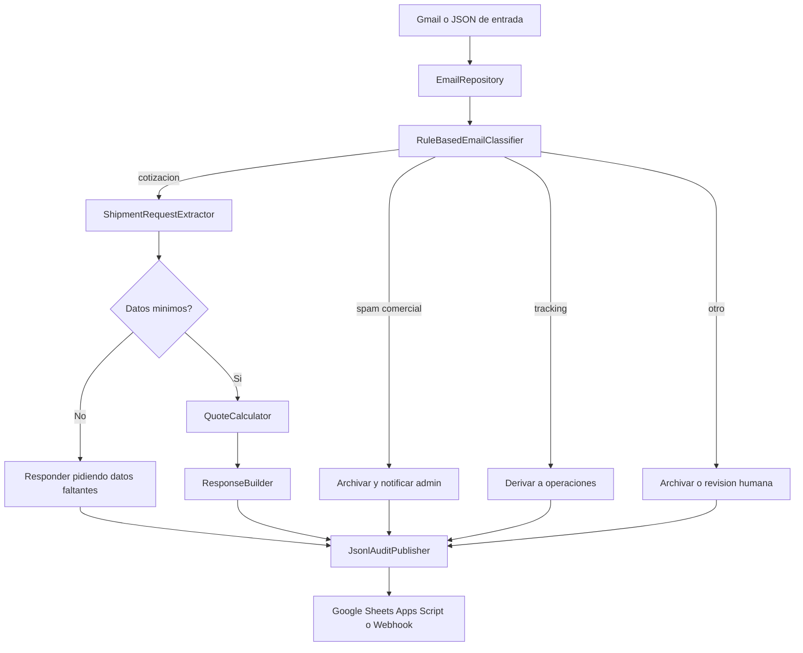

# Flujo de automatizacion

```mermaid
flowchart TD
    A[Gmail o JSON de entrada] --> B[EmailRepository]
    B --> C[RuleBasedEmailClassifier]
    C -->|cotizacion| D[ShipmentRequestExtractor]
    C -->|spam comercial| H[Archivar y notificar admin]
    C -->|tracking| I[Derivar a operaciones]
    C -->|otro| J[Archivar o revision humana]
    D --> E{Datos minimos?}
    E -->|No| F[Responder pidiendo datos faltantes]
    E -->|Si| G[QuoteCalculator]
    G --> K[ResponseBuilder]
    F --> L[JsonlAuditPublisher]
    K --> L
    H --> L
    I --> L
    J --> L
    L --> M[Google Sheets Apps Script o Webhook]
```

SLA objetivo: el flujo local procesa los 5 correos en segundos, por debajo del limite de 5 minutos pedido por el desafio.

